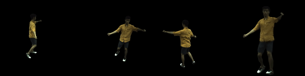

<p align="center">
  <p align="center">
    <h1 align="center">KeypointNeRF: Generalizing Image-based Volumetric Avatars using Relative Spatial Encoding of Keypoints</h1>
  </p>
  <p align="center" style="font-size:16px">
    <a target="_blank" href="https://markomih.github.io/"><strong>Marko Mihajlovic</strong></a>
    ·
    <a target="_blank" href="https://www.aayushbansal.xyz/"><strong>Aayush Bansal</strong></a>
    ·
    <a target="_blank" href="https://zollhoefer.com/"><strong>Michael Zollhoefer</strong></a>
    .
    <a target="_blank" href="https://inf.ethz.ch/people/person-detail.MjYyNzgw.TGlzdC8zMDQsLTg3NDc3NjI0MQ==.html"><strong>Siyu Tang</strong></a>
    ·
    <a target="_blank" href="http://www-scf.usc.edu/~saitos/"><strong>Shunsuke Saito</strong></a>
  </p>
  <h2 align="center">ECCV 2022</h2>
  
  <div align="center"></div> 

  <p align="center">
    <a href="https://pytorch.org/get-started/locally/"></a>
    <a href="https://pytorchlightning.ai/"></a>
    <br>
    <a href='https://arxiv.org/abs/2205.04992'>
      
    </a>
    <a href='https://markomih.github.io/KeypointNeRF/' style='padding-left: 0.5rem;'>
      
    <a href="https://youtu.be/RMs1S5k9vrk"></a>
  </p>
  <p>KeypointNeRF is a generalizable neural radiance field for virtual avatars. Given as input 2-3 images, KeypointNeRF generates volumetric radiance representation that can be rendered from novel views.</p>
</p>

## Installation 
Please install python dependencies specified in `environment.yml`:
```bash
conda env create -f environment.yml
conda activate KeypointNeRF
```

## Data preparation
Please see [DATA_PREP.md](DATA_PREP.md) to setup the ZJU-MoCap dataset.

After this step the data directory follows the structure:
```bash
./data/zju_mocap
├── CoreView_313
├── CoreView_315
├── CoreView_377
├── CoreView_386
├── CoreView_387
├── CoreView_390
├── CoreView_392
├── CoreView_393
├── CoreView_394
└── CoreView_396
```

## Train your own model on the ZJU dataset
Execute `train.py` script to train the model on the ZJU dataset.
```shell script
python train.py --config ./configs/zju.json --data_root ./data/zju_mocap
```
After the training, the model checkpoint will be stored under `./EXPERIMENTS/zju/ckpts/last.ckpt`, which is equivalent to the one provided [here](https://drive.google.com/file/d/1rsMb3DFFXaFw0iK7yoUmoDEaCW_XqfaN/view?usp=sharing).

## Evaluation
To extract render and evaluate images, execute:
```shell script
python train.py --config ./configs/zju.json --data_root ./data/zju_mocap --run_val
python eval_zju.py --src_dir ./EXPERIMENTS/zju/images_v3
```

To visualize the dynamic results, execute:
```shell
python render_dynamic.py --config ./configs/zju.json --data_root ./data/zju_mocap --model_ckpt ./EXPERIMENTS/zju/ckpts/last.ckpt
```

<div align="center"></div> 
<p align="center" style="font-size:12px"> (The first three views of an unseen subject are the input to KeypointNeRF; the last image is a rendered novel view) </p>


We compare KeypointNeRF with recent state-of-the-art methods. The evaluation metric is SSIM and PSNR.
| Models  | PSNR &#8593;  | SSIM &#8593;  |
|---|---|---|
| pixelNeRF <font size="1">(Yu et al., CVPR'21)</font>  |   23.17     | 86.93   |
| PVA <font size="1">(Raj et al., CVPR'21)</font>  |   23.15     | 86.63   |
| NHP <font size="1">(Kwon et al., NeurIPS'21)</font>  |   24.75     | 90.58   |
| KeypointNeRF* <font size="1">(Mihajlovic et al., ECCV'22)</font>  |   **25.86** | **91.07**   |
<p align="left" style="font-size:10px"> (*Note that results of KeypointNeRF are slightly higher compared to the numbers reported in the original paper due to training views not beeing shuffled during training.) </p>


## Publication
If you find our code or paper useful, please consider citing:
```bibtex
@inproceedings{Mihajlovic:ECCV2022,
  title = {{KeypointNeRF}: Generalizing Image-based Volumetric Avatars using Relative Spatial Encoding of Keypoints},
  author = {Mihajlovic, Marko and Bansal, Aayush and Zollhoefer, Michael and Tang, Siyu and Saito, Shunsuke},
  booktitle={European conference on computer vision},
  year={2022},
}
```

## License
[CC-BY-NC 4.0](https://creativecommons.org/licenses/by-nc/4.0/legalcode). 
See the [LICENSE](LICENSE) file. 